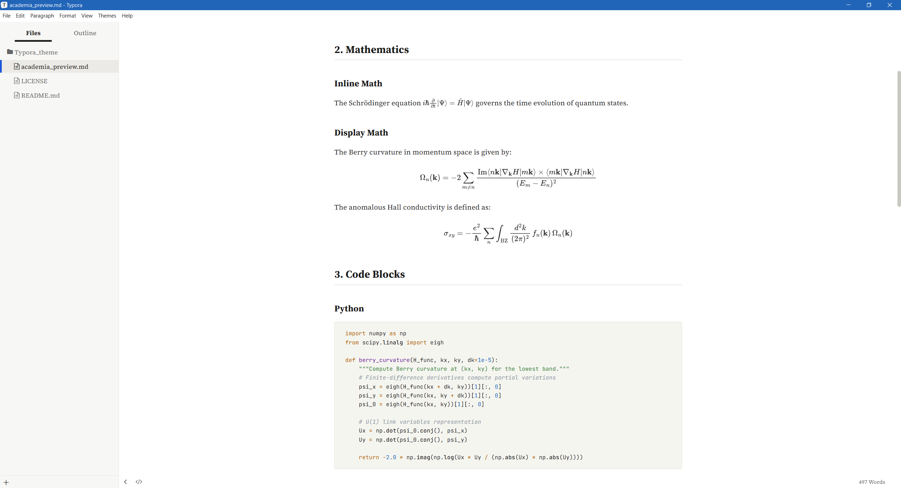
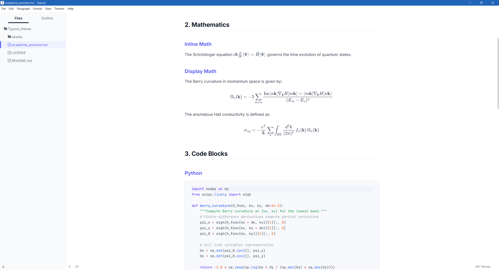
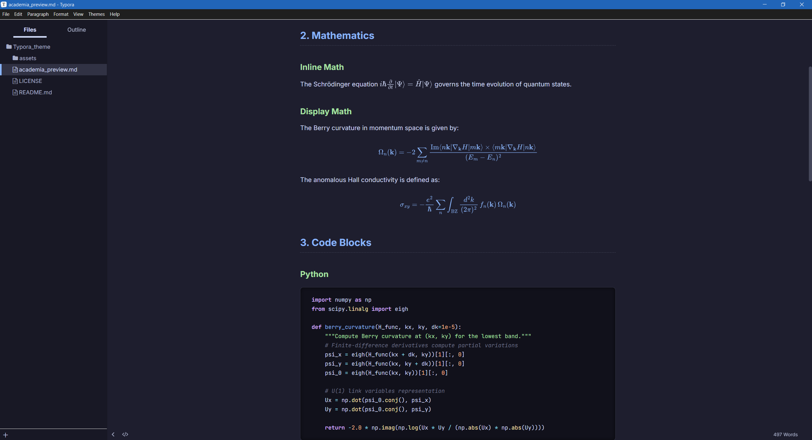
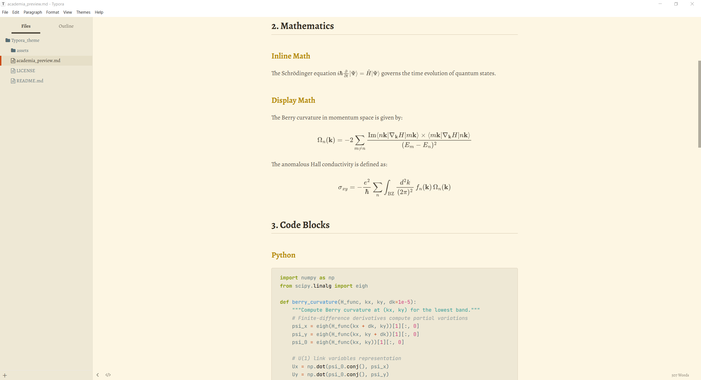

# Typora Academic Themes

A collection of clean, modern, and high-quality Typora themes designed specifically for scientific writing, seamless LaTeX integration, and elegant code blocks.

## Themes Included

### 1. Academia Light
A LaTeX-inspired minimalist theme that mimics the style of academic papers. 
- **Typography:** Serif fonts (`Source Serif 4`, `Noto Serif SC`) optimized for printing and PDF generation.
- **Tables:** Booktabs-style (LaTeX three-line tables).
- **Vibe:** Serious, clean, academic paper feel.

### 2. Clarity
A modern, light theme with an elevated card style for code blocks and vibrant syntax highlighting.
- **Typography:** Sans-serif fonts (`Inter`, `Noto Sans SC`) optimized for comfortable on-screen reading.
- **Code Blocks:** Light elevated-card style with vibrant, highly readable syntax highlighting.
- **Vibe:** Modern IDE, clean interface, highly legible.

### 3. Quantum Dark
A deep space / neon dark mode variant optimized for low-light coding and OLED screens.
- **Typography:** Sans-serif fonts paired with JetBrains Mono.
- **Syntax Highlighting:** High-contrast neon accents (Cyberpunk/Catppuccin Macchiato style) on a deep `#1e1e2e` background.
- **Vibe:** Geeky, hacker, extremely easy on the eyes in the dark.

### 4. Manuscript
An academic retro style imitating theoretical physics manuscripts.
- **Typography:** Pure serif aesthetic (`Alegreya`, `Palatino Linotype`) for an old-school book feel.
- **Colors:** Solarized Light / Sepia toned background (`#fdf6e3`) with deep brown ink text.
- **Vibe:** Immersive, retro, reading a decades-old physics manuscript.

## Installation

1. Open Typora and go to `Preferences` -> `Appearance` -> `Open Theme Folder`.
2. Copy the `.css` files (e.g., `academia.css`, `clarity.css`) into the opened theme folder.
3. Restart Typora.
4. Select your preferred theme from the `Themes` menu.

## Features

- **Cross-Platform Compatibility**: Uses Google Fonts accompanied by optimal fallback system fonts for Windows, macOS, and Linux. No font installation required.
- **LaTeX Math Support**: Perfectly integrated math formatting for both inline `$ ... $` and block `$$ ... $$` math.
- **PDF Export Setup**: Automatically formatted for professional print / PDF layouts. URL links will not pollute the document content in the export.
- **Academic Tables**: Clean, minimalist table styling focusing on data readability.

## Testing Your Theme

You can open the `preview.md` file included in this repository to test how the various elements (Math, Code, Tables, Blockquotes, Lists) render in your selected theme.

## License

This project is licensed under the MIT License - see the [LICENSE](LICENSE) file for details.
